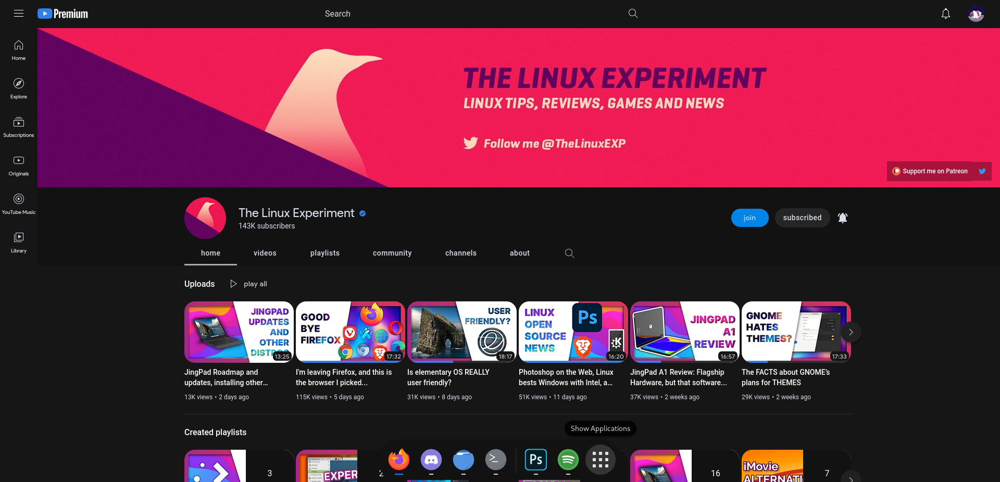

<p align="center">
    
    <h2 align="center">Lunar for YouTube</h2>
</p>

<p align="center">🛰️  A space-inspired theme for YouTube</p>

## 🖼️  Gallery



## ❗ Prerequisites
[Stylus browser extension](https://github.com/openstyles/stylus#releases)

## 💻 Installation

Dark mode is **required** for the theme to work.

[Click here to install spacetube](https://github.com/lunar-theme/youtube/raw/main/lunartube.user.css)


## 🎨 Recommended extensions and styles


* 🛡️ [SponsorBlock](https://sponsor.ajay.app/) | Blocks youtube sponsors, intros and more!

* 🖌️ [Custom Progress Bar](https://33kk.github.io/uso-archive/?style=95280) | Styles your youtube progress bar

* ⚙️ Recommended settings for Custom Progress Bar

  * Custom Color: ```#3281ea```


## 🤝 Contributing

Contributions, issues and feature requests are welcome!<br />Feel free to check [issues page](https://github.com/lunar-theme/spacetube/issues). 

## 🌟 Show your support

Give a ⭐️ if you like this project!

## 📝 Note

This is my **personal** theme, there may be some things that you won't like. You'll need to change that by yourself.
Colors are changable by editing the variables in the file.

## 📩 License

Copyright © 2021 [sheepdev](https://sheepdev.xyz/)<br />
This project is licensed under the [CC-BY-4.0](https://github.com/lunar-theme/spacetube/blob/main/LICENSE) license.
